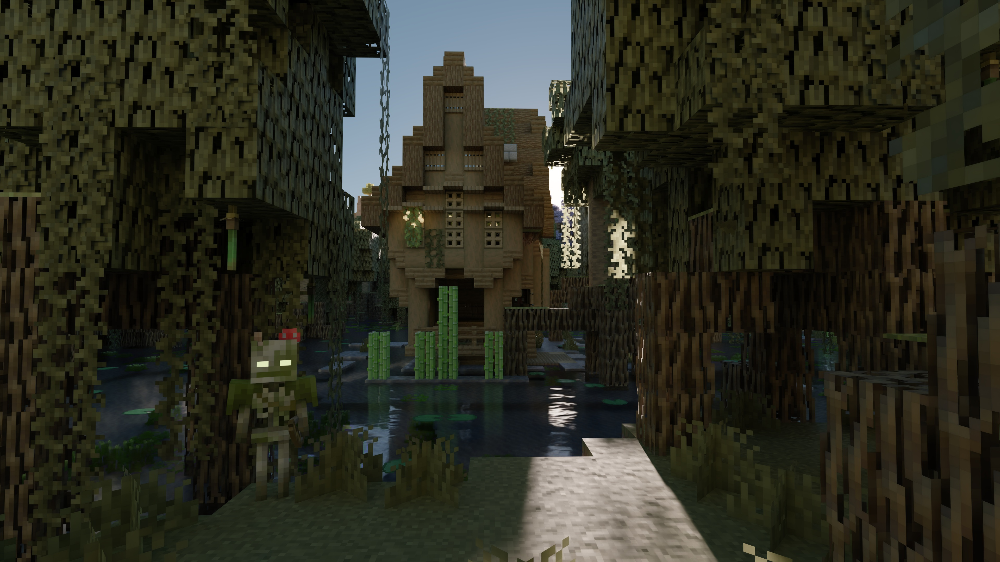

# Caustica — Minecraft 26.3

Hardware-ray-traced renderer for Minecraft's Vulkan backend. It replaces the vanilla world view
with path tracing and the vendor upscaling/denoising stack (DLSS Ray Reconstruction, DLSS Frame
Generation, FSR 3, XeSS, NRD, SVGF) while keeping Minecraft's UI and gameplay intact.



This repository carries Caustica ported to **Minecraft 26.3**. The renderer source was imported from
[`xysgottaken2/testingcasutica`](https://github.com/xysgottaken2/testingcasutica) at the furthest
26.3-ported state available there, and this repository's verification harness (Minecraft ABI
contract + hook call-site contracts) was kept on top of it. See
[Porting 26.2 → 26.3](docs/port-26.2-to-26.3.md) for exactly what changed and what is still
unverified.

## Features

- Vulkan hardware path-traced world rendering
- DLSS Ray Reconstruction, DLSS Frame Generation, FSR 3, XeSS and NRD/SVGF denoising
- HDR output, SDR/HDR presentation paths and exposure control
- Dynamic entity rendering in the ray-traced scene
- LabPBR-style material support, including toggleable subsurface scattering
- Deep settings UI: nearly every renderer feature has its own sub-screen with a "Reset to
  Defaults" button, plus a global one on the hub
- Weather-driven lighting: rain and thunderstorms dim the sun/moon and darken the sky
- Volumetric 3D clouds (classic vanilla-style or photoreal cumulus), volumetric fog with
  per-light god rays, water waves, parallax occlusion mapping
- Dedicated Nether, End and portal skyboxes
- OMM (Opacity Micro-Map) + SER (Shader Execution Reordering) optimizations
- Experimental SHaRC-style world-space radiance cache (toggleable, inspectable via debug view 13)

## Requirements

- **Vulkan graphics backend enabled**
- A GPU and driver with Vulkan ray tracing support
- NVIDIA RTX GPU and a supported driver for DLSS features
- An HDR-capable display and OS HDR mode for HDR output
- On Linux, an HDR-capable Wayland compositor and a native Wayland session for HDR output
- Install a LabPBR resource pack such as [SPBR](https://modrinth.com/resourcepack/spbr)

## Installation

1. Install Fabric Loader **0.19.5** for Minecraft **26.3**.
2. Install **Fabric API 0.161.0+26.3**.
3. Put the Caustica JAR in your Minecraft `mods` folder.
4. Launch the game with the Vulkan graphics backend.

## Building

Requires **JDK 25** and the SPIR-V shader toolchain (`glslangValidator`, `slangc`, `spirv-val`) —
either from the Vulkan SDK (`VULKAN_SDK`) or on `PATH`. Gradle **9.7.0**, Loom **1.18.2**
(no-remap mode: 26.3 ships official names), Loader **0.19.5** and Fabric API **0.161.0+26.3** are
pinned in `gradle.properties`.

```sh
./gradlew --no-daemon build            # JAR + SPIR-V shaders
./gradlew --no-daemon -p buildSrc test # ABI verifier and hook-contract tests
./gradlew --no-daemon check verifyMinecraftAbi verifyModJar
./gradlew runClient --args="--graphicsBackend VULKAN"
```

Vendor upscaler runtimes (NGX/DLSS, FidelityFX, NRD, XeSS) are **not committed**. They are built
from the official SDKs in CI into `build/native/<shim>/release/` and bundled from there; without
them the build still succeeds and the corresponding option is simply not offered at runtime.

## Verification status and limits

`verifyMinecraftAbi` checks the 155 member signatures in
[`docs/minecraft-26.3-abi.tsv`](docs/minecraft-26.3-abi.tsv) against resolved classfiles, and
`verifyModJar` checks the packaged metadata, registered mixins, compiled shaders and bundled
natives. `buildSrc` additionally asserts the bytecode call sites the terrain and entity hooks
depend on.

CI (`.github/workflows/ci.yml`) runs four jobs: a GPU-less JVM lane (buildSrc contract tests →
compile against 26.3 → the renderer unit tests → the ABI contract and hook call sites → JAR
metadata, mixin registration and shaders), the Windows and Linux shim builds, and a packaging job
that rebuilds the JAR with those shim artifacts and asserts that every requested native platform is
really inside it. A failing job publishes its trimmed Gradle diagnostics to a `ci-logs-*` ref,
because Actions logs and artifacts expire long before the code does.

**CI does not run the game.** A green build proves that the sources compile against 26.3, that the
shaders validate as SPIR-V, and that the documented injection points still exist in the client
bytecode. It cannot prove that a Mixin applies, that a hook is reached, or that the rendered image
is correct. Visual validation still has to happen on a Vulkan ray-tracing GPU.

## Compatibility

Caustica takes over the world renderer, so mods that heavily modify world rendering, shader
pipelines, post-processing or the Vulkan backend may conflict. UI-only mods are more likely to work.
Distant Horizons and Voxy have dedicated compatibility paths (`compat/`).

## License

Caustica's project-owned source code and documentation are licensed under the
**GNU Lesser General Public License v3.0 or later**; see [LICENSE.md](LICENSE.md), [COPYING](COPYING)
and [COPYING.LESSER](COPYING.LESSER).

Release artifacts may bundle NVIDIA DLSS/NGX SDK components under NVIDIA's own license terms; see
[THIRD_PARTY_NOTICES.md](THIRD_PARTY_NOTICES.md).
